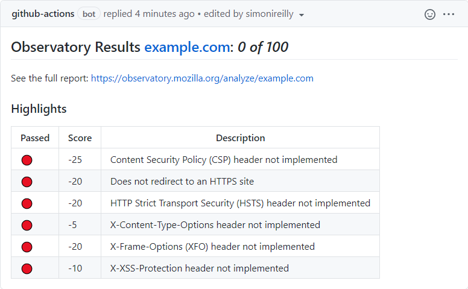
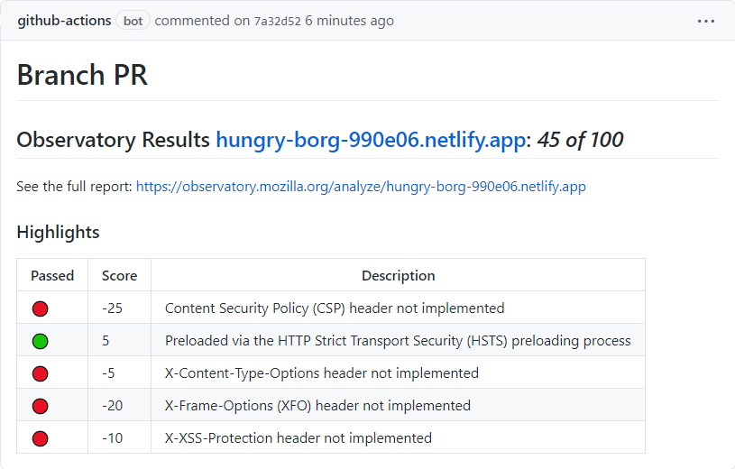
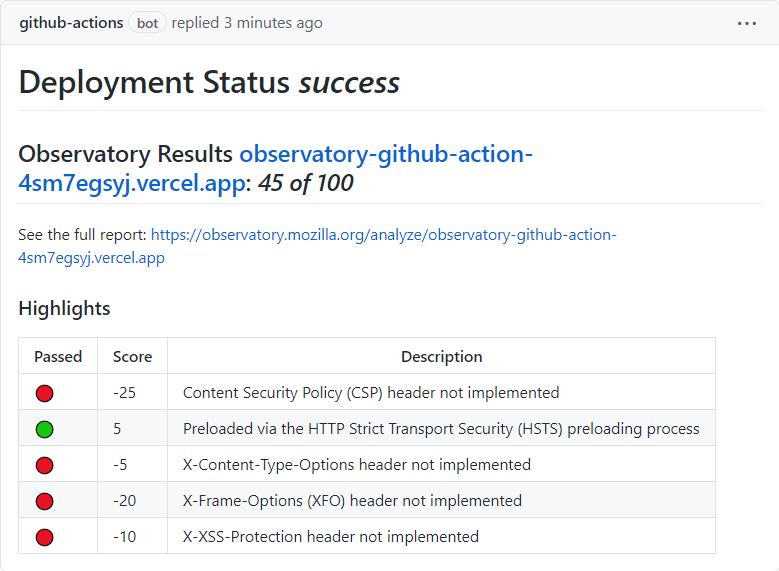

# Observatory GitHub Action

Run the [Mozilla Observatory](https://observatory.mozilla.org/) in CI/CD for any website.

- [Observatory GitHub Action](#observatory-github-action)
  - [About](#about)
  - [Setup](#setup)
  - [Output](#output)
  - [Detailed Examples](#detailed-examples)
    - [Static URL on Pull Requests](#static-url-on-pull-requests)
    - [Deployment Status for Preview Environments](#deployment-status-for-preview-environments)
  - [Contributing](#contributing)
    - [Releasing](#releasing)
  - [Powered By](#powered-by)

## About

This action is a light wrapper around [mozilla/observatory-cli](https://github.com/mozilla/observatory-cli) that returns a markdown string.

It can be used in conjunction with other comment based actions to add PR comments
## Setup

Add the action as a step in your github actions:

>.github/workflows/example.yml
```yaml
      - name: Observatory Github Action
        id: observatory
        uses: simonireilly/observatory-github-action@v0.0.1
        with:
          web_host: https://example.com
      # Use any comment plugin that you like, so long as it supports a string input
      - name: Create commit comment
        uses: peter-evans/commit-comment@v1
        with:
          body: ${{ steps.observatory.outputs.observatory-report }}
```

## Output



## Detailed Examples

The github workflows folder contain detailed examples

### Static URL on Pull Requests

```yaml
# examples/workflows/static-url.yml

name: "branch"
on:
  pull_request:

jobs:
  static-url:
    runs-on: ubuntu-latest
    steps:
      - uses: actions/checkout@v3

      - name: Test Observatory
        uses: simonireilly/observatory-github-action@v0.1.0
        id: observatory
        with:
          web_host: https://hungry-borg-990e06.netlify.app

      - name: Create commit comment
        uses: peter-evans/commit-comment@v1
        with:
          body: "# Branch PR ${{ steps.observatory.outputs.observatory-report }}"

```

*Output*



### Deployment Status for Preview Environments

This method will work for Preview deploys that use the GitHub deployments API. It supports [https://vercel.com/](https://vercel.com/) preview Urls.

```yaml
# examples/workflows/deployment_status.yml

name: "deployment-status"
on:
  deployment_status:

jobs:
  deployment_status:
    runs-on: ubuntu-latest
    if: github.event.deployment_status.state == 'success'
    steps:
      - uses: actions/checkout@v3

      - name: Test Observatory
        uses: simonireilly/observatory-github-action@v0.1.0
        id: observatory

      - name: Create commit comment
        uses: peter-evans/commit-comment@v1
        with:
          body: "# Deployment Status _${{ github.event.deployment_status.state }}_ ${{ steps.observatory.outputs.observatory-report }}"

```

*Output*



## Contributing

Fork the repository and create a MR against the upstream.

### Releasing

To release, with master branch checked out run:

```
yarn pub:beta
```

If this is to be a latest release run:

```
yarn pub:latest
```

Keep the changelog up to date between merge releases with:

```markdown
## [Unchanged]
```

## Powered By

- [HTTP Observatory](https://github.com/mozilla/http-observatory) by April King
- [HTTP Observatory CLI](https://github.com/mozilla/observatory-cli) by April King
